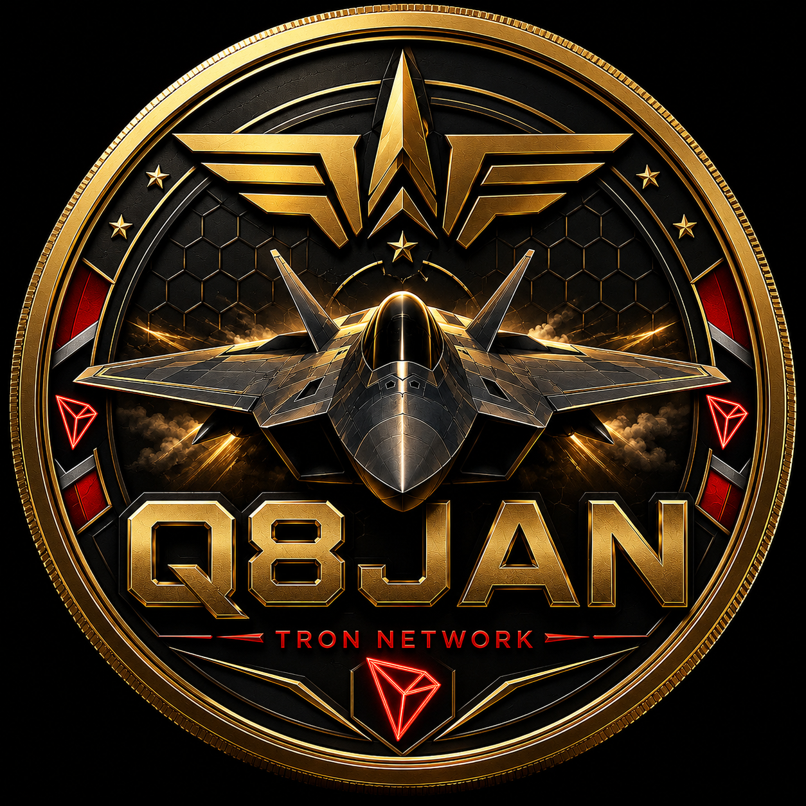

# Q8JAN



> A transparent, fixed-supply digital asset project with production-ready smart contracts for BNB Smart Chain and TRON.

---

# Project Status

**Current Status:** Launch Ready

Development has been completed.

The smart contracts, documentation, website, deployment scripts, and repository have been finalized.

The project is currently waiting for on-chain deployment.

---

# Overview

Q8JAN is a fixed-supply blockchain token designed with simplicity, transparency, and long-term sustainability.

The project follows a clean tokenomics model:

- Fixed Supply
- No Mint
- No Transaction Tax
- Burn Supported
- Open Source

---

# Supported Networks

## TRON

Current launch target.

Deployment scripts are completed and ready.

## BNB Smart Chain

Production-ready implementation is included inside this repository.

---

# Token Information

| Property | Value |
|----------|-------|
| Name | Q8JAN |
| Symbol | Q8JAN |
| Total Supply | 100,000,000,000 |
| Decimals | 18 |
| Mint | Disabled Forever |
| Burn | Enabled |
| Transaction Tax | 0% |
| Ownership | Standard OpenZeppelin |

---

# Smart Contract Features

- Fixed Supply
- ERC20 Standard
- ERC20Burnable
- No Mint Function
- No Blacklist
- No Pause
- No Hidden Owner Privileges
- OpenZeppelin Contracts
- Security Focused

---

# Repository Structure

```text
branding/
contracts/
docs/
logo/
scripts/
test/
tron/
index.html
style.css
README.md
```

---

# Development

## Install

```bash
npm install
```

## Compile

```bash
npx hardhat compile
```

## Test

```bash
npx hardhat test
```

---

# TRON Development

Move into the TRON workspace:

```bash
cd tron
```

Install dependencies:

```bash
npm install
```

Compile:

```bash
npm run compile
```

Deploy:

```bash
npm run deploy
```

---

# Documentation

Project documentation includes:

- Whitepaper
- Litepaper
- Tokenomics
- Roadmap
- Deployment Guide
- Launch Checklist
- Audit Checklist
- Media Kit
- Investor One Pager

---

# Website

Official Website

https://jarrahnour.github.io/Q8JAN/

---

# Security

Security is a priority.

Current implementation includes:

- Fixed Supply
- No Mint
- Burn Support
- OpenZeppelin Libraries
- Transparent Source Code

If you discover a security issue, please report it responsibly before public disclosure.

---

# Deployment

Deployment has **not** been executed yet.

The smart contracts are ready.

Deployment will begin once the deployment wallet is funded with TRX.

---

# Official Sources

Official GitHub Repository

https://github.com/JARRAHNOUR/Q8JAN

Official Website

https://jarrahnour.github.io/Q8JAN/

Contract Address

To be announced after official deployment.

---

# Warning

There is currently **no officially deployed Q8JAN smart contract**.

Any contract claiming to represent Q8JAN before an official announcement should be considered unofficial.

Always verify information using the official GitHub repository and official website.

---

# License

Released under the MIT License.

See LICENSE for details.

---

# Disclaimer

Nothing contained in this repository constitutes financial, legal, tax, or investment advice.

Users should perform their own research before interacting with blockchain assets.

---

© 2026 Q8JAN Project

All Rights Reserved.